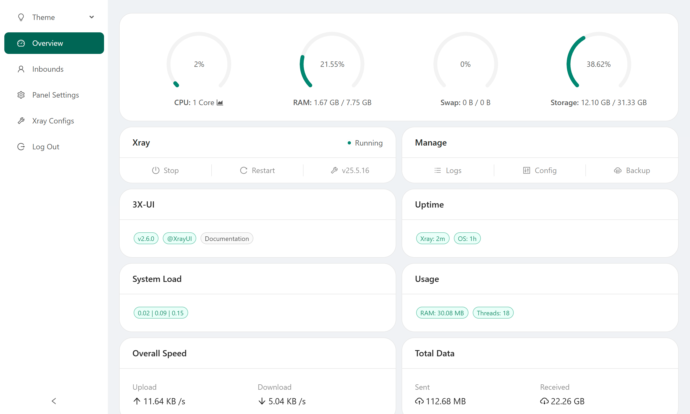
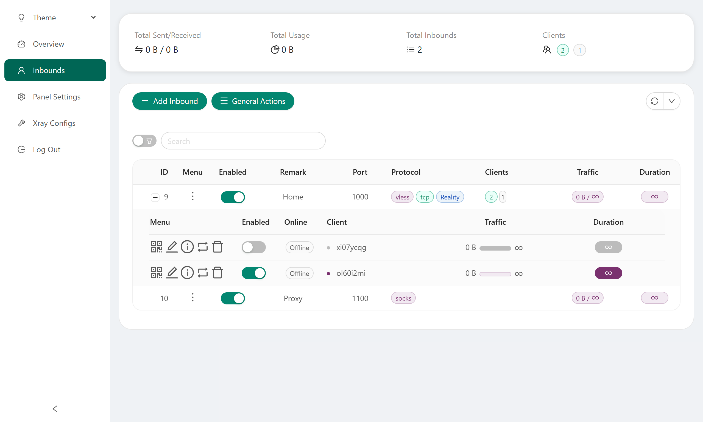
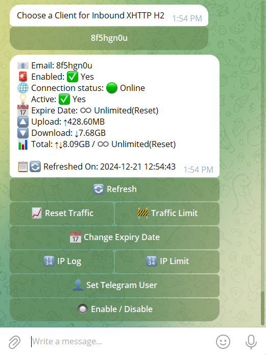

<p align="center">
  <picture>
    <source media="(prefers-color-scheme: dark)" srcset="./media/4x-ui-dark.png">
    
  </picture>
</p>

[](https://github.com/sharif102007/4x-ui/releases)
[](https://github.com/sharif102007/4x-ui/actions)
[](#)
[](https://github.com/sharif102007/4x-ui/releases/latest)
[](https://www.gnu.org/licenses/gpl-3.0.en.html)
[](https://pkg.go.dev/github.com/sharif102007/4x-ui/v2)
[](https://goreportcard.com/report/github.com/sharif102007/4x-ui/v2)

**4X-UI** — advanced, open-source web-based control panel designed for managing Xray-core server. It offers a user-friendly interface for configuring and monitoring various VPN and proxy protocols.

> [!IMPORTANT]
> This project is only for personal usage, please do not use it for illegal purposes, and please do not use it in a production environment.

As an enhanced fork of the original X-UI project, 4X-UI provides improved stability, broader protocol support, and additional features.

### Native Xray Payload Bypass

WebSocket inbounds include an optional **Payload Bypass** switch. The existing
inbound port remains public while 4x-ui automatically places Xray on a hidden
loopback backend and handles the initial HTTP payload handshake in native Go.
No Python payload-proxy installation is required.

## Quick Start

```bash
bash <(curl -Ls https://raw.githubusercontent.com/sharif102007/4x-ui/main/install.sh)
```

For full documentation, please visit the [project Wiki](https://github.com/sharif102007/4x-ui/wiki).

Repository guides:

- [Traffic, speed, and network behavior](./BANDWIDTH-LIMITS.md)
- [Build and GitHub release](./BUILD_AND_DEPLOY.md)
- [Latest v1.1.11 release notes and project details](./RELEASE_NOTES_v1.1.11.md)

<details>
<summary>Panel screenshots</summary>

<p align="center">
  <picture><source media="(prefers-color-scheme: dark)" srcset="./media/01-overview-dark.png"></picture>
  <picture><source media="(prefers-color-scheme: dark)" srcset="./media/02-inbounds-dark.png"></picture>
  <picture><source media="(prefers-color-scheme: dark)" srcset="./media/03-add-inbound-dark.png"></picture>
  <picture><source media="(prefers-color-scheme: dark)" srcset="./media/04-add-client-dark.png"></picture>
  <picture><source media="(prefers-color-scheme: dark)" srcset="./media/05-settings-dark.png"></picture>
  <picture><source media="(prefers-color-scheme: dark)" srcset="./media/06-configs-dark.png"></picture>
  <picture><source media="(prefers-color-scheme: dark)" srcset="./media/07-bot-dark.png"></picture>
</p>

</details>

## Acknowledgment

- [Iran v2ray rules](https://github.com/chocolate4u/Iran-v2ray-rules) (License: **GPL-3.0**): _Enhanced v2ray/xray and v2ray/xray-clients routing rules with built-in Iranian domains and a focus on security and adblocking._
- [Russia v2ray rules](https://github.com/runetfreedom/russia-v2ray-rules-dat) (License: **GPL-3.0**): _This repository contains automatically updated V2Ray routing rules based on data on blocked domains and addresses in Russia._

## Stargazers over Time

[](https://starchart.cc/sharif102007/4x-ui)
